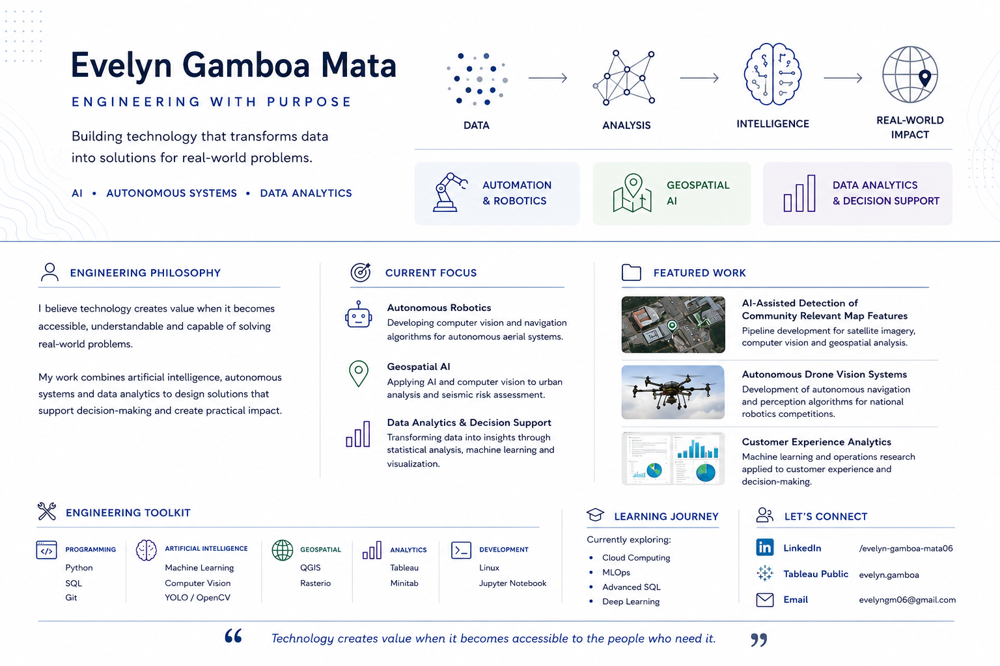

  

---

## 👋 About Me

I'm Evelyn Gamboa Mata, a Data Science and Mathematics Engineering student at Tecnológico de Monterrey.

I enjoy building technology that transforms data into practical solutions, especially in:

- 🤖 Autonomous Robotics
- 🗺️ Geospatial AI
- 📊 Data Analytics & Decision Support

My goal is to develop technology that is accessible and helps people make better decisions.

---

## 🚀 Featured Projects

### 🛰️ AI-Assisted Detection of Community Relevant Map Features
Computer vision pipeline for satellite imagery and seismic risk assessment.

### 🤖 Autonomous Robotics
Navigation, PID control, computer vision and AprilTags for autonomous drone competitions.

### 📊 Customer Experience Analytics
Machine Learning and Operations Research applied to Net Promoter Score (NPS).

---

## 🛠 Tech Stack

Python • SQL • Git • Machine Learning • Computer Vision • YOLO • QGIS • Tableau • Linux

---

## 📫 Let's Connect

LinkedIn:
linkedin.com/in/evelyn-gamboa-mata06

Tableau:
evelyn.gamboa

Email:
evelyngm06@gmail.com
